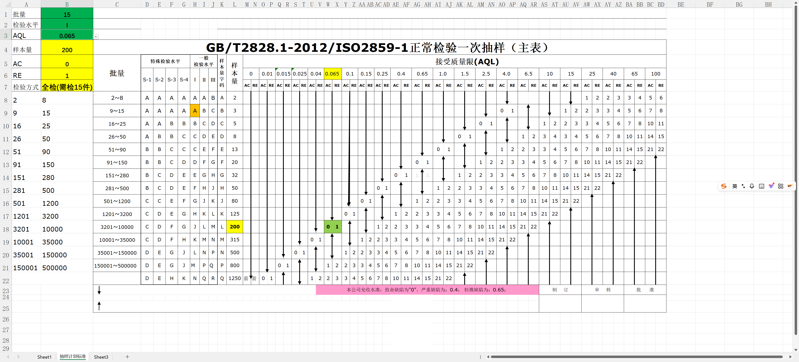

# GB/T 2828.1-2012 抽样标准计算工具

中文 | [English](README_EN.md)

[](https://opensource.org/licenses/MIT)
[](https://www.microsoft.com/excel)
[](http://www.gb688.cn/bzgk/gb/)
[](https://docs.microsoft.com/office/vba/api/overview/)

> 基于国标 GB/T 2828.1-2012 / ISO 2859-1 正常检验一次抽样方案的Excel自动计算工具

## ✨ 特性

- 🎯 **4个Excel自定义函数** - 在任意单元格轻松使用
- 📊 **批量计算** - 支持多行数据自动计算
- 🔍 **自动判断** - 智能识别全检/抽检场景
- ✅ **完整测试** - 28个测试案例全覆盖
- 📝 **详细文档** - 完整的中文文档和示例
- 🚀 **5分钟上手** - 快速开始指南

## 📸 使用演示



## 📁 项目文件清单

```
.
├── 抽样计算.vba              # VBA源代码（主文件）
├── 工作表事件代码.vba         # 工作表事件处理代码
├── README.md                # 项目说明（中文）
├── LICENSE                  # MIT开源协议
└── .gitignore              # Git忽略配置
```

## 📥 获取和使用

### 方式1：下载成品文件（推荐给普通用户）⭐

前往 [**Releases**](../../releases) 页面下载 `抽样标准GB2828.xlsm` 文件，直接打开使用。

> 注意：因为包含VBA宏，首次打开需要"启用内容"。

### 方式2：从源码构建（推荐给开发者）

#### 第一步：准备Excel文件
1. 打开 Excel，创建或准备好 GB/T 2828.1-2012 标准数据表
2. 按 `Alt + F11` 打开VBA编辑器

#### 第二步：导入VBA代码
1. 菜单：插入 → 模块
2. 打开 `抽样计算.vba`，复制全部代码粘贴到模块窗口
3. 关闭VBA编辑器（按 `Alt + Q`）

#### 第三步：测试和保存
在任意单元格输入公式：
```excel
=获取样本量(150, "Ⅱ", 1.5)
```
回车，应该看到结果：`20`

保存为 `.xlsm` 格式（启用宏的工作簿）

## 📚 核心函数

### VBA自定义函数（4个）

| 函数名 | 说明 | 示例 | 返回值 |
|--------|------|------|--------|
| `获取样本量()` | 计算抽样样本量 | `=获取样本量(150,"Ⅱ",1.5)` | 20 |
| `获取Ac值()` | 获取接收数 | `=获取Ac值(150,"Ⅱ",1.5)` | 1 |
| `获取Re值()` | 获取拒收数 | `=获取Re值(150,"Ⅱ",1.5)` | 2 |
| `获取检验类型()` | 判断全检/抽检 | `=获取检验类型(150,"Ⅱ",1.5)` | 抽检 |

### 完整计算函数
```excel
=计算抽样(150, "Ⅱ", 1.5)
```
返回数组：`{样本量, Ac值, Re值, 检验类型}`

## 📖 参数说明

### 批量 (PL)
- **类型**：整数
- **范围**：2 ~ 500000以上
- **示例**：`150`, `5000`, `100000`

### 检验水平
- **特殊水平**：`"S-1"`, `"S-2"`, `"S-3"`, `"S-4"`
- **一般水平**：`"Ⅰ"`, `"Ⅱ"`, `"Ⅲ"` （也可写为 `"I"`, `"II"`, `"III"`）
- **注意**：必须用双引号包围

### AQL值（接收质量限）
可选值（21个标准值）：
```
0.01, 0.015, 0.025, 0.04, 0.065,
0.1,  0.15,  0.25,  0.4,  0.65,
1.0,  1.5,   2.5,   4.0,  6.5,
10,   15,    25,    40,   65,    100
```

## 💡 使用示例

### 示例1：单个计算
```excel
A1: 批量          B1: 150
A2: 检验水平      B2: Ⅱ
A3: AQL          B3: 1.5
A4: 样本量        B4: =获取样本量(B1, B2, B3)
A5: 接收数(Ac)    B5: =获取Ac值(B1, B2, B3)
A6: 拒收数(Re)    B6: =获取Re值(B1, B2, B3)
```

### 示例2：批量处理
创建表格，自动计算多个样品：

|序号|批量|检验水平|AQL|样本量|Ac|Re|
|----|----|----|----|----|----|----| 
|1|50|Ⅱ|1.5|=获取样本量(B2,C2,D2)|=获取Ac值(B2,C2,D2)|=获取Re值(B2,C2,D2)|
|2|500|Ⅱ|2.5|=获取样本量(B3,C3,D3)|=获取Ac值(B3,C3,D3)|=获取Re值(B3,C3,D3)|
|3|1500|Ⅲ|1.0|=获取样本量(B4,C4,D4)|=获取Ac值(B4,C4,D4)|=获取Re值(B4,C4,D4)|

向下拖动填充公式即可批量计算。

## 📋 典型应用场景

### 场景1：产品出厂检验
```
批量：500件
检验水平：Ⅱ（一般检验）
AQL：1.5（允许少量不合格）
→ 样本量：50件，Ac=2，Re=3
```

### 场景2：关键零部件检验
```
批量：1000件
检验水平：Ⅲ（较严格）
AQL：0.4（严格要求）
→ 样本量：80件，Ac=2，Re=3
```

### 场景3：小批量检验
```
批量：10件
检验水平：Ⅱ
AQL：1.5
→ 样本量：10件，全检
```

## ❓ 常见问题

### Q1：显示 #NAME? 错误
**原因**：VBA函数未加载

**解决**：
1. 确认VBA代码已正确导入
2. 文件已保存为 `.xlsm` 格式
3. 检查宏安全设置（文件→选项→信任中心→宏设置）

### Q2：显示 #VALUE! 错误
**原因**：参数类型错误

**解决**：
- 检验水平必须用引号：`"Ⅱ"` 而不是 `Ⅱ`
- 批量必须是数字
- AQL值必须是标准值之一

### Q3：如何输入罗马数字？
**方法1**：使用英文字母
- `"I"` 代替 `"Ⅰ"`
- `"II"` 代替 `"Ⅱ"`
- `"III"` 代替 `"Ⅲ"`

**方法2**：使用输入法
- 搜狗拼音：输入 `v1`, `v2`, `v3`
- 使用下拉列表（推荐）

## 🔗 相关标准

- **GB/T 2828.1-2012**：计数抽样检验程序 第1部分：按接收质量限（AQL）检索的逐批检验抽样计划
- **ISO 2859-1**：Sampling procedures for inspection by attributes -- Part 1: Sampling schemes indexed by acceptance quality limit (AQL) for lot-by-lot inspection

## 📄 使用许可

本项目采用 MIT 许可证 - 详见 [LICENSE](LICENSE) 文件

## 🤝 贡献指南

欢迎提交问题（Issues）和功能请求（Feature Requests）！

如果你想贡献代码：
1. Fork 本项目
2. 创建你的特性分支 (`git checkout -b feature/AmazingFeature`)
3. 提交你的更改 (`git commit -m 'Add some AmazingFeature'`)
4. 推送到分支 (`git push origin feature/AmazingFeature`)
5. 开启一个 Pull Request

## ⭐ 支持项目

如果这个工具对你有帮助，请给个 Star ⭐️ 支持一下！

---

**版本**：v1.1  
**创建日期**：2025-11-21  
**更新日期**：2025-11-22  
**适用标准**：GB/T 2828.1-2012 / ISO 2859-1  
**检验类型**：正常检验一次抽样
